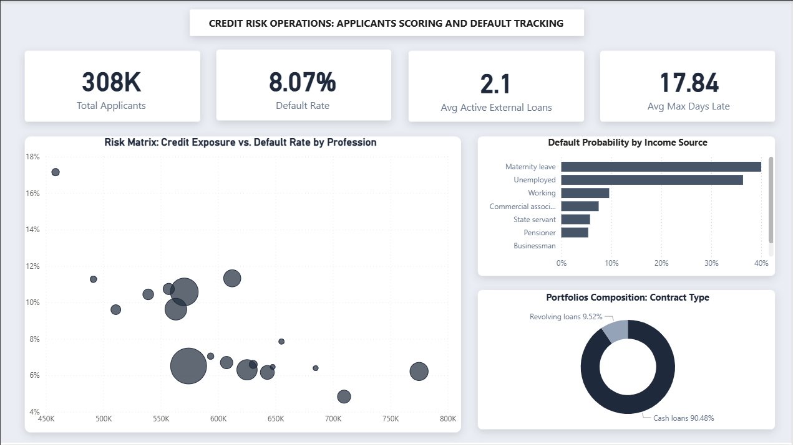

# Enterprise Credit Risk Architecture: End-to-End Pipeline & Executive Dashboard

## Business Context
Evaluating credit risk requires understanding a borrower's historical behavior, not just their current application. The objective of this project was to ingest, model, and visualize 13 million rows of raw data to give underwriters a fast, accurate view of risk exposure. 

I bypassed standard BI templates and built the pipeline from scratch—handling heavy data processing in a local PostgreSQL database before deploying a custom executive dashboard in Power BI.

## System Architecture & Engineering

### 1. Backend Data Processing (PostgreSQL)
To keep the final dashboard fast and responsive, I handled all heavy data transformations in the database before the data ever reached Power BI.
* Data Ingestion: I loaded massive CSV files into a local PostgreSQL database using optimized SQL commands.
* Flattening the Data: I wrote SQL CREATE VIEW scripts to combine historical credit bureau records and past installment payments into a single, clean table.
* Extracting Risk Signals: Instead of importing raw, messy transaction data, I used SQL to calculate specific behavioral flags—such as a borrower's maximum days past due and their total number of active external loans.

### 2. Downstream Transformation (Power Query)
To handle dirty enterprise data, I applied localized cleaning in the BI layer before building the data model.
* Exposing Missing Data: I identified a massive volume of blank entries in the applicant occupation column. Using Power Query, I explicitly replaced these nulls with 'Not Provided', transforming a missing data error into a highly visible operational insight on the final dashboard.

### 3. The Semantic Model (Power BI Star Schema)
By doing the heavy lifting in PostgreSQL, I kept the Power BI data model clean and mathematically accurate.
* Preventing Data Bloat: I structured the table relationships strictly to avoid duplicate rows, ensuring fast load times and accurate calculations.
* Flawless Filtering: I built a standard Star Schema with the application data at the center. This ensures that when a user clicks a chart, the entire dashboard updates instantly and accurately.
* Centralized Logic: I stored all analytical calculations (like Default Rate and Average Max Days Late) in a dedicated Measure Table so the system remains organized and easy to update.

### 4. Interface Architecture (UI/UX)
I designed the dashboard to look and function like a modern web application, deliberately avoiding cluttered, generic templates.
* Custom Dashboard Layout: I designed a custom, high-contrast background to reduce visual clutter and keep the user focused entirely on the metrics.
* Interactive Navigation: I removed traditional dropdown menus. The entire dashboard relies on visual cross-filtering, allowing underwriters to click directly on demographic bars to seamlessly filter the rest of the data.
* Clean Visuals: I stripped away decorative logos, heavy borders, and unnecessary gridlines. Every chart is dedicated purely to showing business risk or financial exposure.

## Key Insights & Deliverables
The final product is a dynamic dashboard that allows underwriters to instantly assess risk exposure. By analyzing the historical data, I identified the following:

* Macro-Level Risk: Applicants in lower-skill labor sectors showed a default rate significantly higher than the portfolio average, indicating a clear need for stricter approval thresholds for these demographics.
* The Cost of Past Lateness: My SQL extraction of historical records proved a strong correlation: applicants with a history of being more than 30 days late on past loans are highly likely to default on new applications.
* Portfolio Concentration: Over 90% of the bank's total loan volume and risk exposure is tied up in standard Cash Loans rather than Revolving Credit, making strict upfront underwriting on Cash Loans critical to the business.
* Data Collection Blind Spot: The analysis revealed that the largest segment of total credit exposure belongs to applicants with an unrecorded occupation. This highlights a critical operational flaw: allowing the occupation field to be optional on the initial loan application creates a massive gap in the bank's risk modeling.
